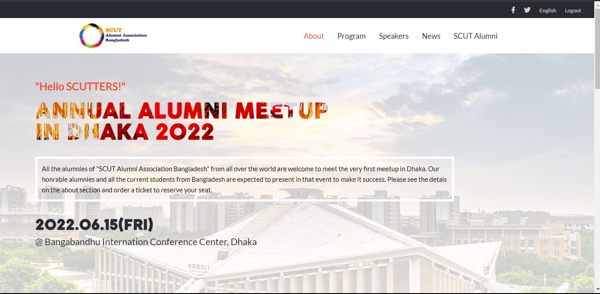
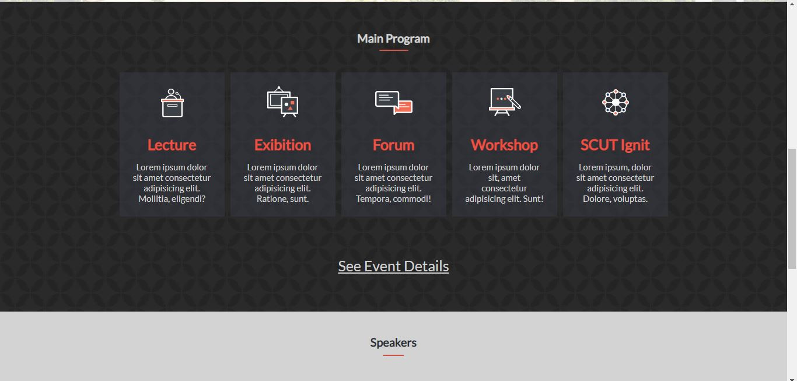
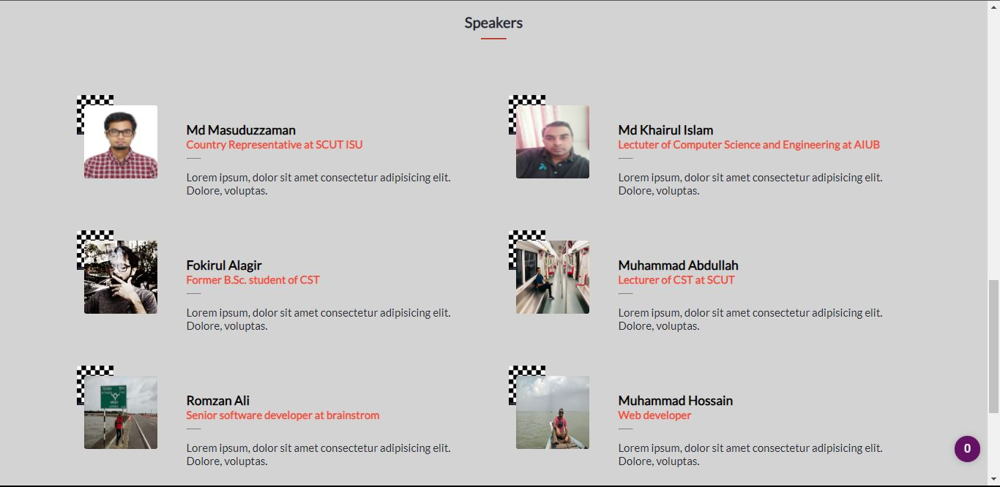
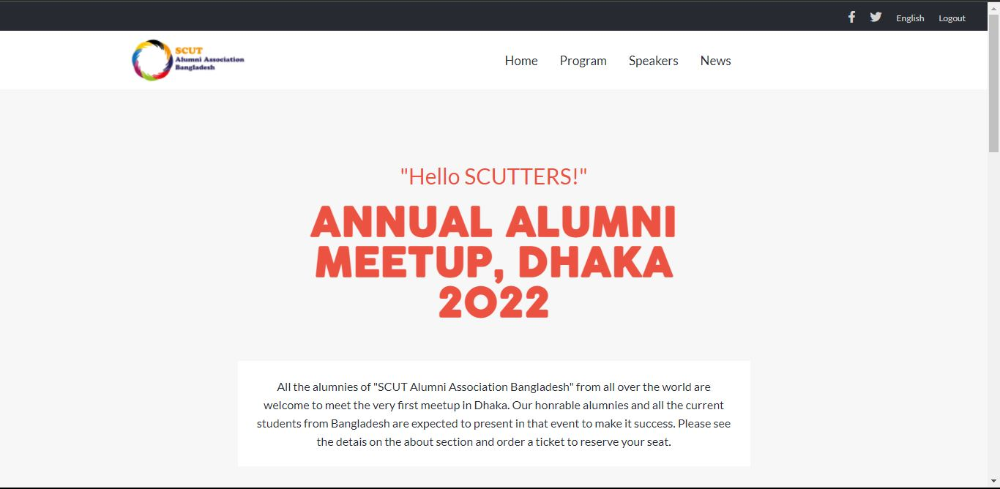
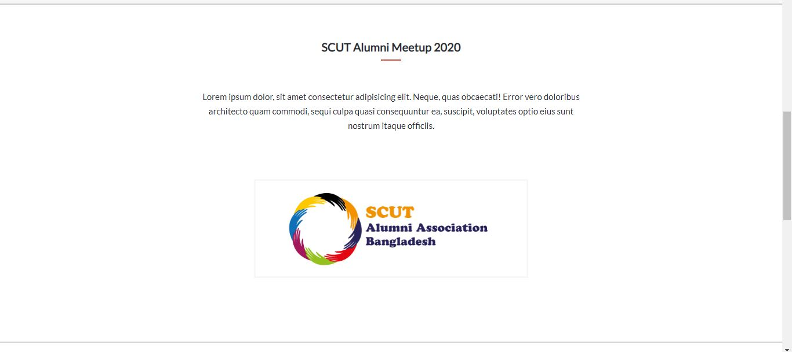
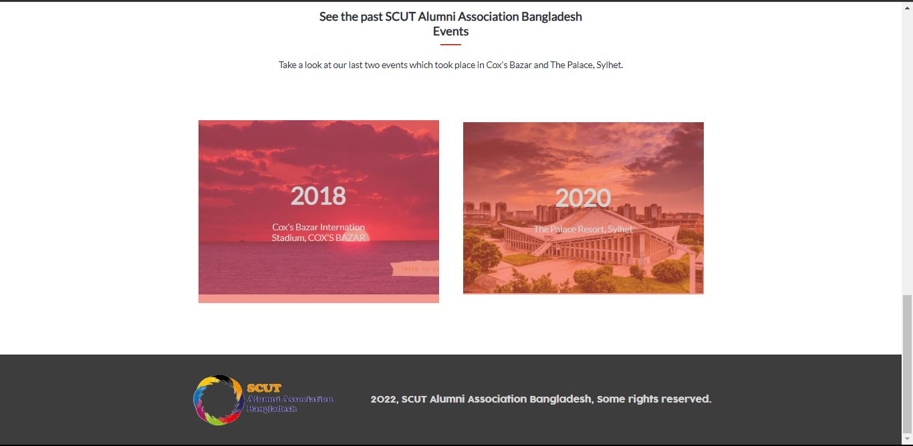

# Student Alumni website

 This is a website where SCUT Alunmi Association Bangladesh committee post their event details about their association. It's my first capstone project of module 1 at Microverse. This project contains two pages i. Home Page ii. About Page . This project has been made with HTML,CSS and JavaScript. CSS FlexBox, JavaScript HTML DOM manipulation has been used to make the website interactive. Speakers section in the Home page has been created with JS and HTML DOM and fetching data from JS object to make that section dynamically created. Microverse standard has been followed throughout the development of this project.

## Built With

- html, css, javascript

## Live Demo

[Have a look...](https://masuduzzaman811.github.io/Capstone-1/)

### Install
- install git in your local machine.
- install VS code (optional)

## Setup

- Go to a terminal or Git Bash or Command Prompt and type: git clone https://github.com/Masuduzzaman811/Capstone-1.git
- Edit the source code in any IDE you prefer
- Render it with any browser!!!

## Package Manager

- node.js
- npm

## project explaining video

[Loom Video](https://www.loom.com/share/0e849c7965504297ac83dbe923f0ea7b)

## Screenshot

+

## Author

👤 **Md Masuduzzaman**

- [GitHub](https://github.com/Masuduzzaman811)
- [Twitter](https://twitter.com/msd_811)
- [LinkedIn](https://www.linkedin.com/in/msd811/)

## 🤝 Contributing

Contributions, issues, and feature requests are welcome!

Feel free to check the [issues page](../../issues/).

## Show your support

Give a ⭐️ if you like this project!

## Acknowledgments
- The Original design is made by [Cindy Shin in Behance.](https://www.behance.net/adagio07) . Thanks to Cindy Shin.

- A part of the logo has been made by Kreativkolors / Freepik .

## 📝 License

This project is [MIT](./MIT.md) licensed.
